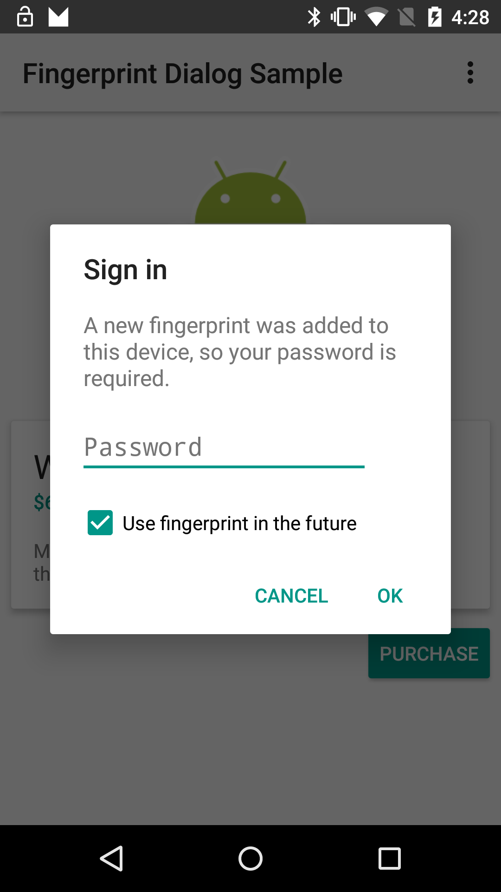

Cryptology
===================================

Uses fingerprint authentication to encrypt and decrypt and store information on the cloud.

Introduction
------------

This sample demonstrates how you can use registered fingerprints in your app to authenticate the user
before proceeding some actions such as purchasing an item.

Pre-requisites
--------------

- Android SDK v23
- Android Build Tools v23.0.1
- Android Support Repository

Screenshots
-------------

    

Getting Started
---------------

This project uses the Gradle build system. To build this project, use the
"gradlew build" command or use "Import Project" in Android Studio.

License
-------

Copyright 2014 The Android Open Source Project, Inc.

Licensed to the Apache Software Foundation (ASF) under one or more contributor
license agreements.  See the NOTICE file distributed with this work for
additional information regarding copyright ownership.  The ASF licenses this
file to you under the Apache License, Version 2.0 (the "License"); you may not
use this file except in compliance with the License.  You may obtain a copy of
the License at

http://www.apache.org/licenses/LICENSE-2.0

Unless required by applicable law or agreed to in writing, software
distributed under the License is distributed on an "AS IS" BASIS, WITHOUT
WARRANTIES OR CONDITIONS OF ANY KIND, either express or implied.  See the
License for the specific language governing permissions and limitations under
the License.
